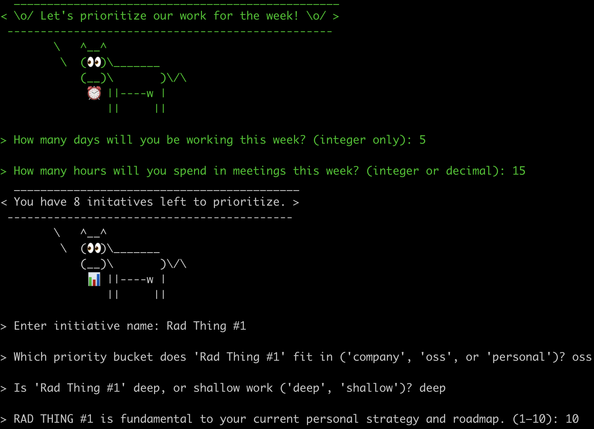

## Deep Work Prioritizer
A simple personal CLI dialogue that can be used for ranking weekly work priorities around the concept of '[deep work' vs. 'shallow work'](calnewport.com/books/deep-work/). It attemps to give an estimate of the actual time that can be allocated for doing your weekly deep and shallow work based on common time factors like meetings, short-weeks, etc.

### Time Factors
👉 By providing the number of scheduled meeting hours and number of days you're working this week, your actual availability for deep & shallow work can be calculated.
 
👉 All priorities identified as **deep work** are evenly split across 75% of the actual working hours you've allotted this week.
 
👉 All priorities identified as **shallow work** are evenly split across 25% of the actual working hours you've allotted this week.

### Usage
Install via $`npm install -g deep-work-prioritizer`, then run the command: `deep-work`.
